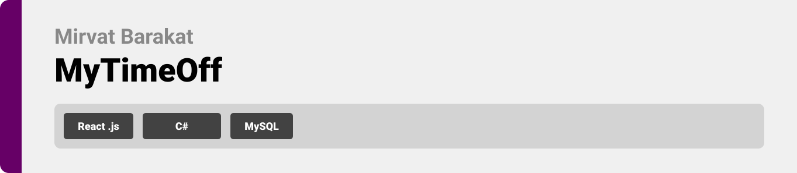
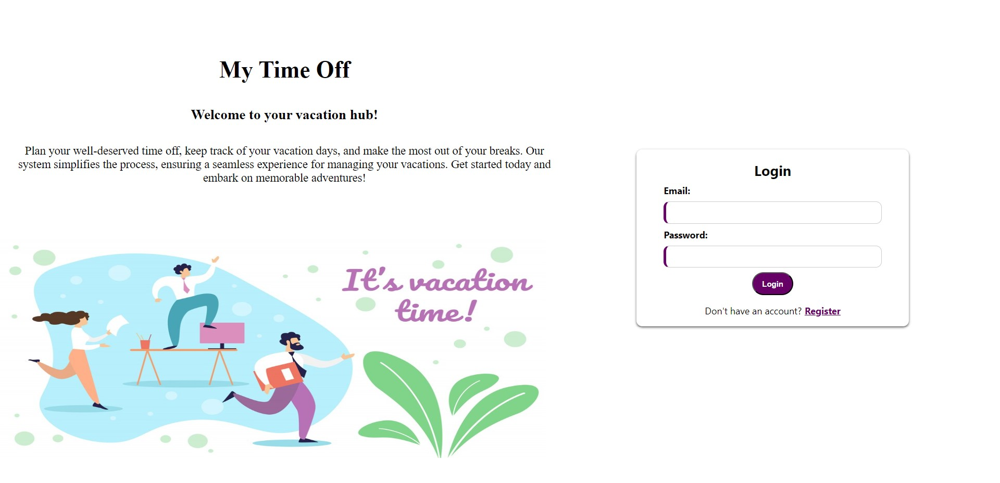
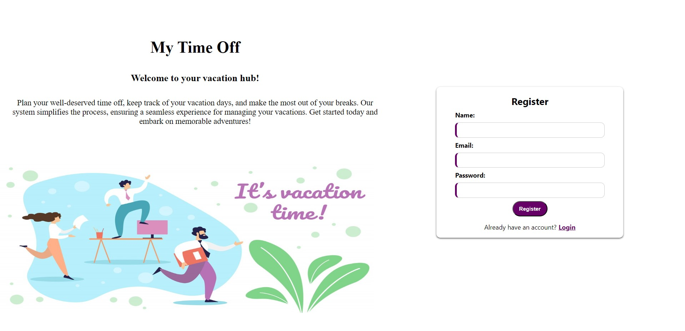
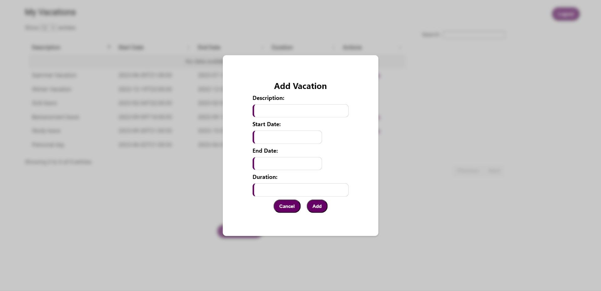
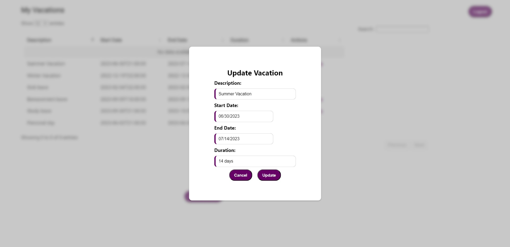
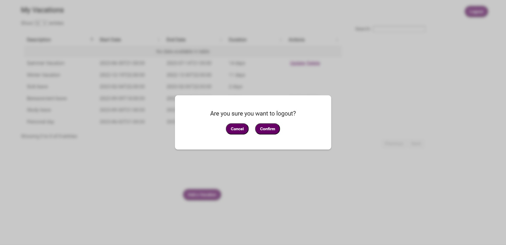
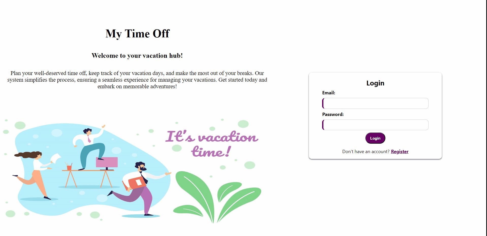

Leave-Management-App: A simple CRUD web app that allows employees to request and manage their vacation time efficiently.
<br><br>

<!-- Implementation -->


### My Time Off Screens

| Login                                      | Register                                |
| -------------------------------------------------------- | ------------------------------------------------------ |
|     |  |
| Add Vacation                                | Update Vacation                          |
|  |       |
| Delete Vacation                                      | Logout                                          |
|        |       |
  
### My Time Off Demo

| My Time Off Demo           |
| -------------------------------------------------------- |
|  |   

<br><br>

<!-- How to run -->


> To set up MyTimeOff locally, follow these steps:

### Installation

Clone the repo

```sh
git clone https://https://github.com/mirvat-barakat/MyTimeOff
```

### MyTimeOff Backend


### MyTimeOff frontend

In `frontend` :

In The Terminal Run:

```sh
  npm install
```

```sh
  npm start
```

<br>
